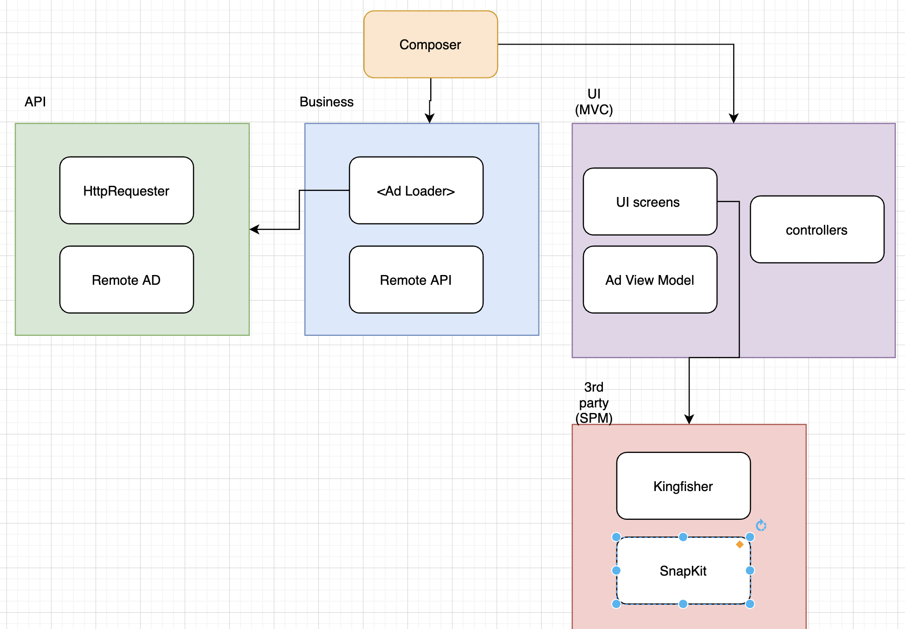

###How did you approach the task?
    My main purpose of the task to show my skills in separating concerns, modularization, reusability, maintainability, and scalability.
    All the sectins of the page can be reordered, redesigned, reused in very little effort.
    
    The starting point is the SceneDelegate where you can create a DefaultViewItemController (with the remote) or dummy,
    
###What architecture-layers did you create and why?
     API, UI, Business 
     The diagram will explain more details
      
     Used different design patterns as well : 
        Composition
        Dependency Injection
        Composition Root
        Delegation
        Observable
        
     
###What would you do if you had more time?
    Fix constraints issues
    Write unit tests
    Wrapper class for third party tools
    
    
###Which trade-offs did you take?
    Didn't follow localization
    
    
    

